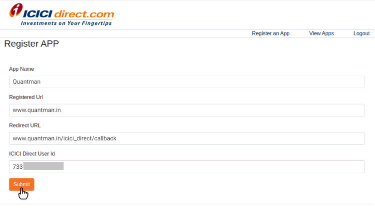
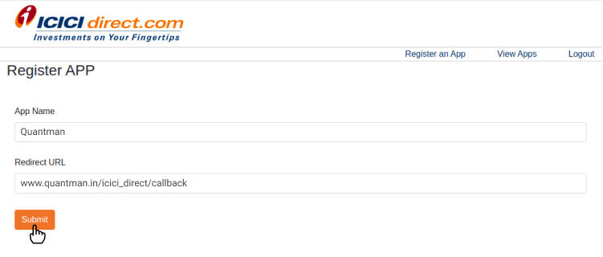
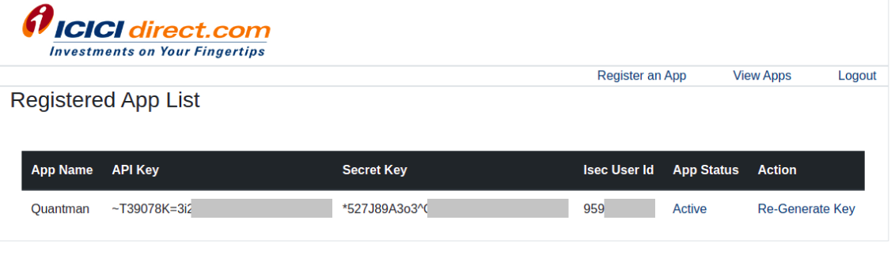

# ICICI Direct Api Credentials

#### Step 1

To start click on this link- <b><a href="https://api.icicidirect.com/apiuser/apihome">https://api.icicidirect.com/apiuser/apihome</a></b>

#### Step 2

Click on the Signup or Login.

<figure markdown>{ width="auto" }</figure>

#### Step 3

After successful logging in, Click on <b>Register an App</b>

<figure markdown>{ width="auto" }</figure>

#### Step 4

Fill below details and submit.

<b>App Name:</b> Quantman 
<b>Registered URL:</b> www.quantman.in 
<b>Redirect URL:</b> www.quantman.in/auth/icici_direct/callback 
<b>ICICI Direct User Id:</b> Your ICICI Direct User Id

<figure markdown>{ width="auto" }</figure>

#### Step 5

Click <b>Generate key</b> button in popup.

<figure markdown>{ width="auto" }</figure>

#### Step 6

Click on <b>Submit</b>.

<figure markdown>{ width="auto" }</figure>

#### Step 7

Click <b>View Apps</b>

<figure markdown>{ width="auto" }</figure>

#### Step 8

Click <b>Deactive</b> in App status.

<figure markdown>{ width="auto" }</figure>

#### Step 9

Click Yes button in confirmation popup and refresh the page.

<figure markdown>{ width="auto" }</figure>

#### Step 10

Now, Please check your app status if its  <b>Active</b>

<figure markdown>{ width="auto" }</figure>

#### Step 11

Copy and paste api details in appropriate fields below.

<figure markdown>{ width="auto" }</figure>