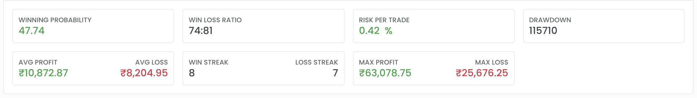

# Backtest Result

#### What is a Transaction ?
If you have backtest with configuration to 

- buy one lot CE ITM:1 option and 
- buy one lot PE OTM:1 option

Then a transaction in this configuration will have 4 orders.

| Type  | Order |
|-------|-------|
| Entry Order 1         | buy one lot CE ITM:1 option   |
| Entry Order 2         | buy one lot PE OTM:1 option   |
| Exit/Stoploss Order 1 | sell one lot CE ITM:1 option  |
| Exit/Stoploss Order 2 | sell one lot PE OTM:1 option  |

## Run Graph

Shows the overall cumulative profit/loss over the period of backtest. If the first transaction has profitof Rs.1000 on Jan 01,2021 and second transaction has loss of Rs.800 on Jan 02, 2021. The graph will show Rs.1000 on Jan 1 and Rs.200 on Jan 02. You can zoom in/out in the graph to view the details as you want.

## Metrics

In the backtest output page, just after the graph we show the below metrics for the backtest.

<figure markdown>{ width="auto" }</figure>

#### Winning Probability:

It is the percentage of hit transactions(transactions that resulted in a profit). If you have 10 transactions in the backtest and 8 of them had profit. Then the winning probability is 80%.

#### Win/Loss Ratio:

Win loss ratio is the ratio of total number of winning/hit transactions(transactions that resulted in a profit) to the total number of loss/miss transactions(transactions that resulted in a loss).
#### Risk per trade:

TODO:

#### Drawdown:

Drawdown is the maximum downward your fund balance goes from its previous highest point.
#### Average Profit/Average Loss:

Average profit is the average of all successful *transactions*'s profit.
Average loss is the average of all losing *transaction*'s loss
#### Win Streak/Loss Streak:

Win streak in the maximum continuous number of winning/hit transactions and loss stream is the maximum number of loss/miss transactions. If you backtest had transactions with following profits 100, -100, 200, 210, 215, 220, -50, -60, 150, 10. Then the win streak is 4 (four transactions one after another with profit 200, 210, 215, 220) and loss streak is 2(two transactions  one after another in loss).

#### Max Profit/Max Loss:

Max profit is the maximum profit from a transaction and Max Loss is maximum loss from transaction out of all transactions.
## Analytics
#### Hit(Win) / Miss(Lose)
- Hit: A transaction that ended in profit. 
- Miss: A transaction that ended in loss.

For Multiple Legs Transaction:

- A transaction will be counted as hit, if all orders in the transaction together resulted in an overall profit.
- A transaction will be counted as miss, if all the orders in the transaction together resulted in an overall loss.

<figure markdown>{ width="auto" }</figure>

**Note:** In case of trade type, we show each leg(position) as hit/miss if the leg(position)'s entry+exit resulted in a profit/loss.

#### Trade Type:

  Shows the number of hits/misses and profit/loss for different *positions not transactions*. Different trade types are

- *Futures Long* 
- *Futures Short*
- *Options CE Long*
- *Options CE Short*
- *Options PE Long*
- *Options PE Short*

Lets say the backtest had only one transaction with the following orders

Entry(On Friday Jan 01, 2021): 
  * 1 lot(25 qty) buy Futures Rs. 10000 
  * 1 lot(25 qty) buy Options Strike:xxx CE Rs. 10
  * 1 lot(25 qty) sell Options Strike:xxx PE Rs. 20

Exit(On Friday Jan 01, 2021)
  * 1 lot(25 qty) sell Futures Rs. 10100
  * 1 lot(25 qty) buy Options Strike:xxx CE Rs. 5
  * 1 lot(25 qty) sell Options Strike:xxx PE Rs. 18

then the result would be,

Futures Long        (Hit: 1)   (Miss: 0)  (Profit: 2500 ) (loss: 0)
Options CE Long     (Hit: 0)   (Miss: 1)  (Profit: 0 ) (loss: 125)
Options PE Short    (Hit: 1)   (Miss: 0)  (Profit: 50 ) (loss: 0)

#### Day of Week:

  Shows the number of hits/misses and profit/loss for all transactions on different days like monday/tuesday/wednesday/thursday/friday. 
  If a transaction, entered on monday and exited on tueday. 
  By default it will be shown as hit/miss & profit/loss on tuesday. Using the flipper, if the exit time is selected, it will show the same transaction 
  in tuesday.

#### Day of Year:

  Shows the number of hits/misses and profit/loss for each years in the backtest seperately.
  