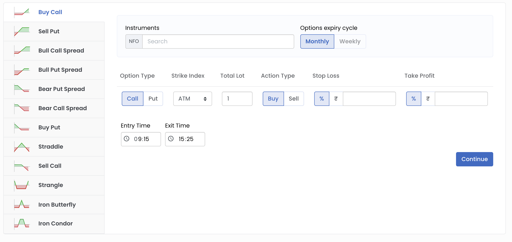
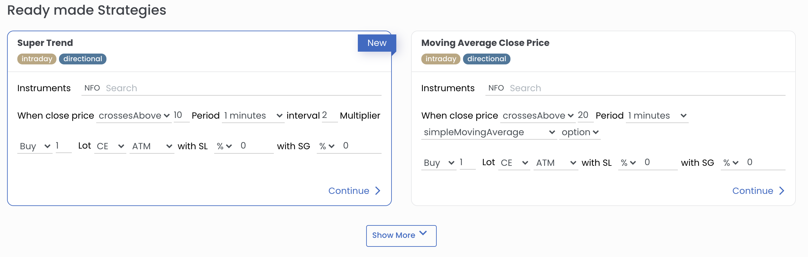
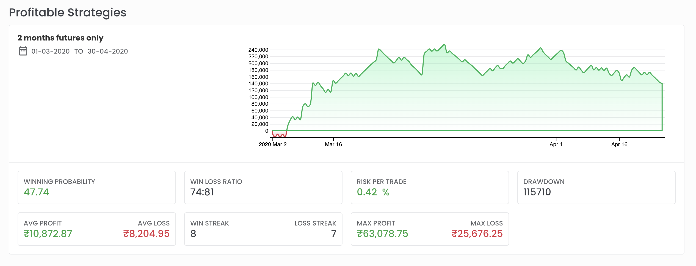
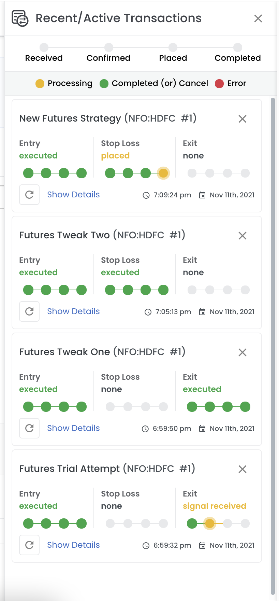
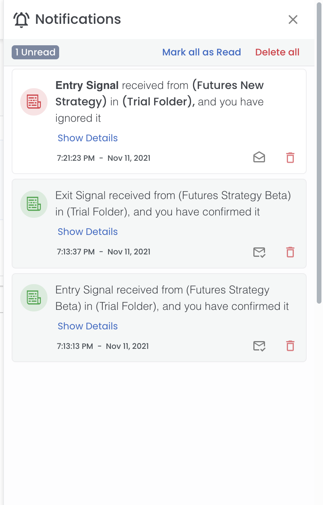
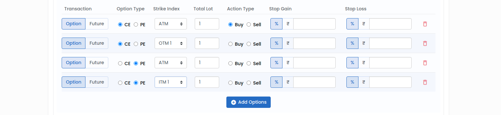

# Welcome / Getting Started

## Create a new Quant
#### 1. Options Strategy Builder

If you want to create a options based strategy like straddle/strangle/... at specified time daily, 

<figure markdown>{ width="auto" }</figure>

1. select the option strategy you want to choose (Buy Call / Straddle / ...)
2. select the instrument. (type nifty and select it)
3. enter the stop gain/stop loss values for each legs
4. click 'continue'
5. In the new quant creation page, everything is already filled based on you selection. Just go to the bottom of the page and 
click 'Run Backtest'
6. In a few seconds, you should have the backtest result for your option strategy.

#### 2. Readmade Strategy Builder
If you want to create a strategy based on super-trend or simple moving average or other such indicators, go to the 
'Readymade Strategies' (second section).

<figure markdown>{ width="auto" }</figure>

1. In supertrend, select the instrument you want. (type nifty and select it)
2. Adjust the candle interval or the CE/PE option that you want buy/sell
3. Click 'continue'
4. In the new quant creation page, everything is already filled based on you selection. Just go to the bottom of the page and 
click 'Run Backtest'
5. In a few seconds, you should have the backtest result for your strategy.

#### 3. Copying And Editing Profitable Strategies
Profitable Strategies lists some of the strategies already backtested and showcased by our platform Admin. You can click left or right button 
and view the different strategies displayed for you. 

<figure markdown>{ width="auto" }</figure>

The Profitable strategy shows the graph of how the profit has increased/decreased over time and few metrics like winning probability, 
win/loss streak, max profit/max loss and a few others.

1. To view a profitable strategy in more detail, click on the "View full details" which is shown when you move the mouse over the graph.
2. Here you will see the strategy in more detail with a lot more details. Each section is explained seperately in another faq page.
3. Click on the "Edit And Copy" button,
4. You will see a new Quant Creator with that profitable strategies configuration. Go through it, change anything you want 
5. Go to the bottom of the page and click 'Run Backtest'
6. In a few seconds, you should have the backtest result ready and displayed.

#### 4. Using Quant Builder
You can create a strategy from scratch using this quant builder. 

1. Click the 'Create' button in the page header.
2. Fill in the date range for which you want to backtest the strategy.
3. Fill in the indicators
4. Add the entry and exit signal based on your indicators 
5. Select the options/future you want to transact when entry signal is achieved.
6. Select appropriate stoploss/stopgain in individual legs and in overall section.
5. Go to the bottom of the page and click 'Run Backtest'
6. In a few seconds, you should have the backtest result ready and displayed.

## Header Icons
---------------------------------------------------------------------------------------------------

<figure markdown>{ width="auto" }</figure>

In the header right side, you will see

1. transactions panel button
2. notifications panel button
3. theme switcher button
4. general settings dropdown

#### 1. Recent/active transactions panel

<figure markdown>{ width="auto" }</figure>

#### 2. Notification panel 

<figure markdown>{ width="auto" }</figure>

{ width="auto" }

#### 3. Theme swicher button

Switch between light theme and dark theme using this button. Go ahead, try it out in [www.quantman.in](htttps://www.quantman.in)

#### 4. General settings dropdown.

You can check your quota usage, notification settings and payment history using these settings pages.