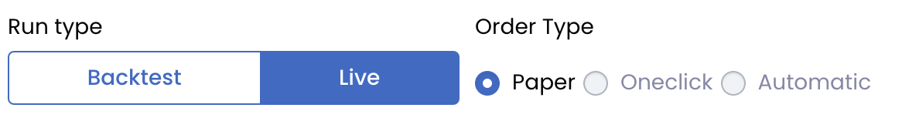
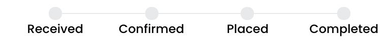
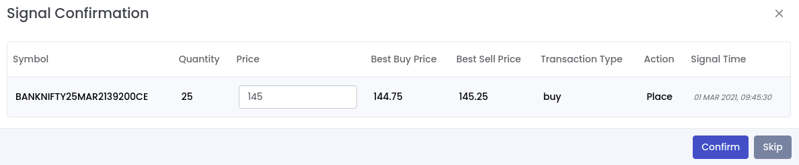

# Live Execution

## Broker Integrated Order Execution Setup

1. Just login via the supported broker.
2. Create a quant and select type live in Run Type.
3. Select the Order execution type to what suits you best
    - Automatic
    - Oneclick
    - Paper

Note: Live deployment with broker api order execution is supported for paid plans and during some offer times supported for 
free plan.

<figure markdown>{ width="auto" }</figure>

## Automatic 

Automatice Order Execution is supported for user registered via supported brokers (for supported brokers of this category check the plan page).
Live deployments with this type, will place orders automatically in the broker account that you are logged in with. 

Different stages in a transaction are displayed below:

<figure markdown>{ width="auto" }</figure>

Note: Order confirmation step is not required in automatic live order execution. Once signals are received they are automatically placed in 
the broker account that you are logged in with.
## One click

One click confirmation order execution is supported for user registered via supported brokers (for supported brokers of this category check the plan page).
Whenever order signals are generated for live deployments of this type you will get

1. Phone call.(you can press 1 to confirm the order).
2. Browser/phone browser notification, if you have allowed quantman.in to send notifications to your browser. In this notification, you can confirm the order.
3. Notification in quantman.in where you can review the order, tweak the order price if required and place order.

<figure markdown>{ width="auto" }</figure>

Once an order is confirmed it will place on the broker. You can track the status of recent transactions in the [*Transactions Panel*](/#1-recentactive-transactions-panel-button)

Different stages in a transaction are displayed below:

<figure markdown>{ width="auto" }</figure>

## Paper

Paper trade live deployment receives signal and just stores it in the database. It can be used to check the performance of a strategy
in live without any brokerage orders. 
