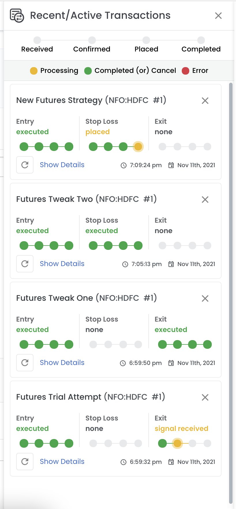

# Recent/Active Transactions Panel

<figure markdown>{ width="auto" }</figure>

You can check the status of recent transactons using the transactions panel. You can open the transactions panel using the 
transactions panel button(first icon in the right side section) in the header.

Below is the image of transaction panel showing transactions in different stages,

Transaction has multiple entry/exit/stop-loss and each of them have multiple stages. Each stage's current status is displayed via

- **Yellow Blinking:** Currently in this stage and processing this stage. 
- **Green:** Completed this stage. 
- **Red:** Failed this stage. 

<figure markdown>{ width="auto" }</figure>

